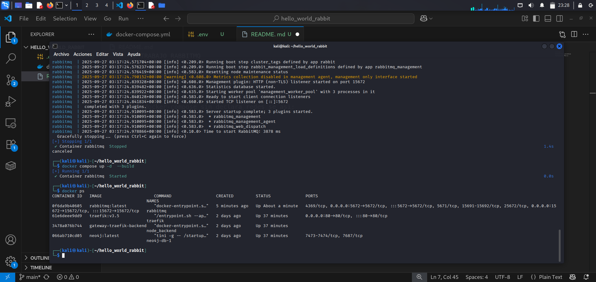
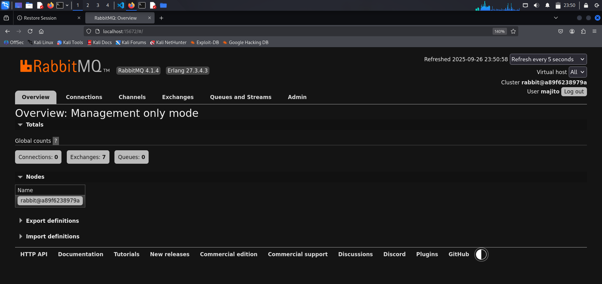
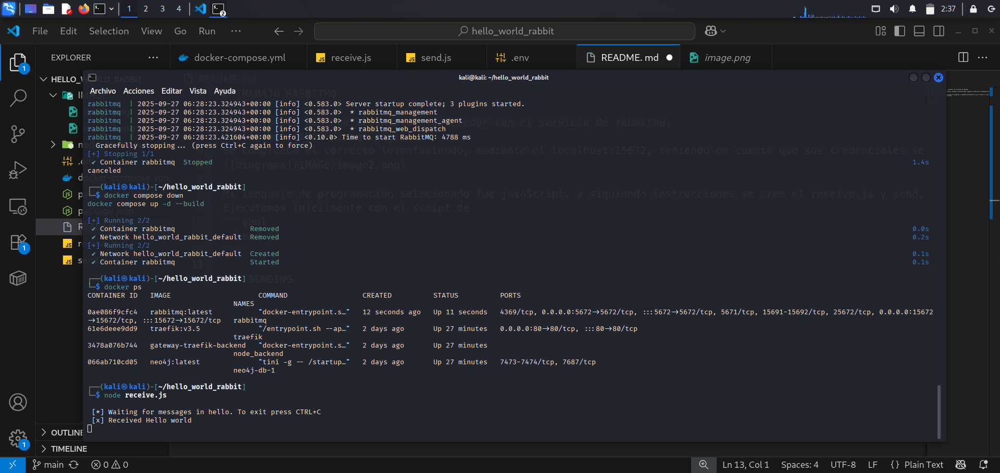
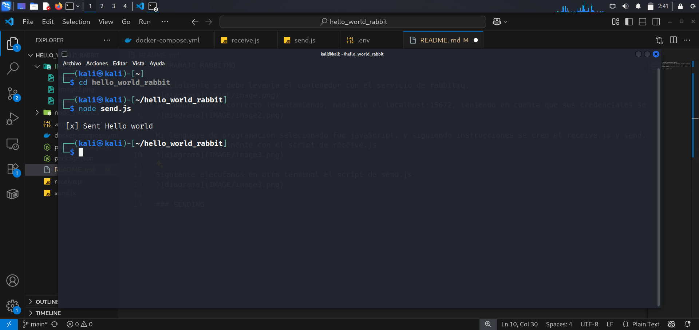

# Trabajo RabbitMQ

Inicialmente, se debe levantar el contenedor con el servicio de RabbitMQ.

Se comprueba que el contenedor se haya levantado correctamente ingresando a `http://localhost:15672`, usando las credenciales que se encuentran en el archivo `.env`.

El lenguaje de programacion seleccionado fue JavaScript. Siguiendo las instrucciones, se crearon los archivos `receive.js` y `send.js`.

Primero, se ejecuta el script `receive.js`:

Luego, en otra terminal, se ejecuta el script `send.js`:

